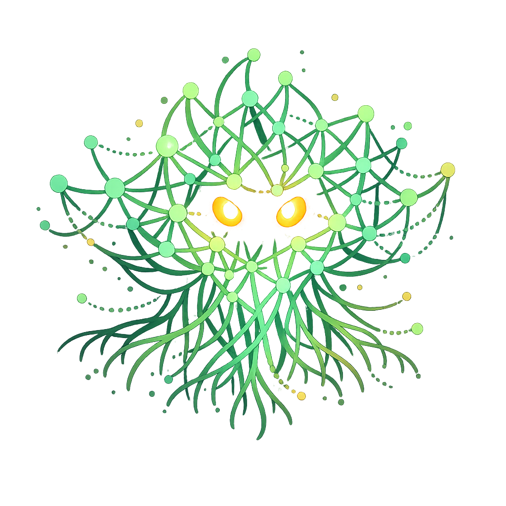

<p align="center">
  
</p>

<h1 align="center">SMESH</h1>

<p align="center">
  <strong>Decentralized LLM coordination · Plant-inspired · Blazing fast</strong>
</p>

<p align="center">
  <a href="#-quick-start">Quick Start</a> •
  <a href="#-what-is-this">What Is This?</a> •
  <a href="#-performance">Performance</a> •
  <a href="#-vs-other-tools">Comparison</a>
</p>

---

## 🚀 Quick Start

```bash
# Build
cargo build --release

# Check everything works
cargo run --bin smesh -- status

# Run a simulation (watch signals flow!)
cargo run --bin smesh -- sim --nodes 50 --ticks 100

# Compare LLM backends (Ollama vs Claude)
ANTHROPIC_API_KEY=... cargo run --bin smesh -- compare
```

---

## 🤔 What Is This?

**TL;DR:** Coordinate multiple LLM agents without a central controller.

| Traditional (LangChain) | SMESH |
|------------------------|-------|
| Central orchestrator routes everything | **No center** — agents self-organize |
| One failure breaks the chain | **Fault tolerant** — signals just decay |
| 10-50ms per coordination step | **~1μs** per signal operation |

### How It Works

Think **plant communication**, not message queues:

```
   Agent A emits          Signals decay           Agent B senses
   "need review"          over time               & claims task
        ↓                     ↓                        ↓
      ████████░░░░░░░░░░░░░░░░░░░░░░░░░░░░░░░████████
      
   Multiple agents agree → Signal gets reinforced → Consensus emerges
```

**Key ideas:**
- 📡 **Signals diffuse** through a shared field
- ⏱️ **Signals decay** — stale tasks fade away  
- 🤝 **Reinforcement** — agreement strengthens signals
- 🌿 **Emergent** — no explicit voting needed

---

## ⚡ Performance

| What | Speed |
|------|-------|
| Signal creation | **216 ns** (4.6M/sec) |
| Signal reinforcement | **48 ns** (20M/sec) |
| 100-node network tick | **14 μs** |

### LLM Backends

| Backend | Latency | Cost |
|---------|---------|------|
| **Ollama** (local) | 0.1-1s | Free |
| **Claude** (API) | 1-4s | Pay per token |

---

## 🏗️ Architecture

```
smesh-rust/
├── smesh-core/      # Signals, nodes, fields, networks     ✓
├── smesh-runtime/   # QUIC P2P networking                  ✓
├── smesh-agent/     # Ollama + Claude backends             ✓
└── smesh-cli/       # CLI tools & benchmarks               ✓
```

**All components complete.** 80 tests passing.

---

## ⚔️ vs Other Tools

### vs LangChain

| | LangChain | SMESH |
|-|-----------|-------|
| **Speed** | ~10-50ms/step | **~1μs/signal** |
| **Architecture** | Central DAG | Decentralized |
| **Failure mode** | Chain breaks | Signals decay |
| **Memory** | High (Python) | **Low (Rust)** |

### vs CrewAI / AutoGPT

| | CrewAI | SMESH |
|-|--------|-------|
| **Scaling** | Linear | **Sublinear** |
| **Consensus** | Explicit voting | **Emergent** |
| **Control** | Role prompts | Trust + decay |

---

## ✅ When to Use

**Good for:**
- 3+ LLM agents coordinating
- Fault-tolerant systems
- High-throughput (many signals/sec)
- Edge deployment (single binary)

**Not for:**
- Single chatbot
- Strict sequential workflows
- Exactly-once guarantees

---

## 📚 Core Concepts

| Concept | One-liner |
|---------|-----------|
| **Signal** | Message with intensity that decays over time |
| **Node** | Entity that emits, senses, and reinforces signals |
| **Field** | Shared space where signals live and propagate |
| **Network** | Topology connecting nodes (ring, mesh, small-world, etc.) |

---

## 🔧 CLI Commands

```bash
smesh status              # Check system & Ollama connection
smesh sim                 # Run signal simulation
smesh agents --demo       # LLM agent coordination demo
smesh compare             # Benchmark Ollama vs Claude
smesh bench               # Signal processing benchmarks
smesh review --path ./repo    # SMESH-coordinated code review
smesh code                # Multi-agent coding swarm (Claude)
smesh swarm --path ./repo # Vulnerability scanning swarm
```

---

## 🔍 Code Review (NEW)

Multi-agent code review using signal diffusion:

```bash
cargo run --bin smesh -- review --path ./some-repo --model qwen2.5-coder:7b
```

| Agent | Focus |
|-------|-------|
| **Security** | Unsafe code, vulnerabilities, input validation |
| **Performance** | Allocations, algorithms, hot paths |
| **Style** | Idiomatic Rust, patterns, organization |
| **Documentation** | Doc comments, examples, clarity |

Agents emit findings as signals → related reviewers reinforce → consensus emerges.

---

## 🌿 Coding Swarm (NEW)

Multi-agent collaborative coding that demonstrates true SMESH coordination:

```bash
cargo run --bin smesh -- code
cargo run --bin smesh -- code --coders 3 --format json
```

| Agent | Role |
|-------|------|
| **Architect** | Designs module structure, defines interfaces |
| **Coder** (2x) | Implements code from specs |
| **Tester** | Writes and runs tests |
| **Reviewer** | Reviews code quality |

**SMESH concepts in action:**
- 📡 **Signal coordination** — Agents emit Task, Claim, Code, Review, TestResult signals
- 🤝 **Emergent consensus** — Modules complete when review + tests agree
- 📊 **Trust evolution** — Trust scores change based on code acceptance and test results

```
Trust Evolution:
  Reviewer→Coder-A [███████   ] 0.70  (code approved)
  Tester→Coder-A   [████      ] 0.45  (1 pass, 1 fail)
  Tester→Coder-B   [█         ] 0.20  (2 fails)
```

---

## 📄 License

MIT OR Apache-2.0 — pick whichever works for you.
